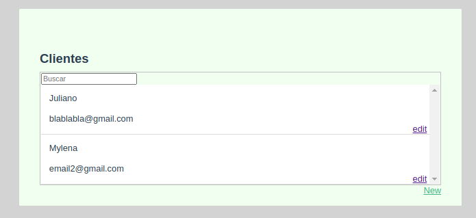

# Clients CRUD


This is a simple Clients CRUD and a study exercise. This uses docker-compose for container orchestration. The application was created with:
* backend:
    - node.js
    - typeorm
* frontend
    - vue.js

To create this repository, I joined the [backend](https://github.com/Juliano-rb/clients-crud-backend) and [frontend](https://github.com/Juliano-rb/clients-crud-frontend) repositories using a monorepo strategy described at [How to migrate to Mono Repository without losing any Git history](https://medium.com/@filipenevola/how-to-migrate-to-mono-repository-without-losing-any-git-history-7a4d80aa7de2).

# Running
Run the following command to build and start the application using docker-compose:
```bash
docker-compose build && docker-compose up
```